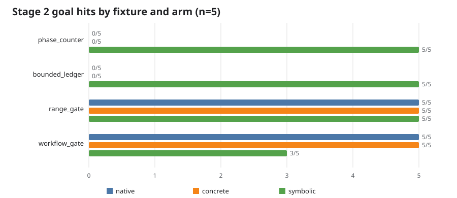

# Stage 2 benchmark report

Local teaching-state-machine exploration only; this report does not claim vulnerabilities.

Valid results: **60 / 60**

| Fixture | Arm | Valid | Goal hits | New states | New coverage | Accepted/used seeds |
| --- | --- | ---: | ---: | --- | --- | --- |
| bounded_ledger | concrete_augment | 5/5 | 0/5 | [5, 10, 8, 14, 8] | [0, 0, 0, 17, 0] | [0, 0, 0, 0, 0] / [0, 0, 0, 0, 0] |
| bounded_ledger | native_resume | 5/5 | 0/5 | [5, 10, 8, 15, 8] | [0, 0, 0, 17, 0] | [0, 0, 0, 0, 0] / [0, 0, 0, 0, 0] |
| bounded_ledger | symbolic_augment | 5/5 | 5/5 | [6, 10, 9, 14, 8] | [1, 1, 1, 18, 1] | [1, 1, 1, 1, 1] / [1, 1, 1, 1, 1] |
| phase_counter | concrete_augment | 5/5 | 0/5 | [5, 10, 7, 7, 6] | [0, 0, 0, 0, 0] | [0, 0, 0, 0, 0] / [0, 0, 0, 0, 0] |
| phase_counter | native_resume | 5/5 | 0/5 | [5, 10, 7, 7, 6] | [0, 0, 0, 0, 0] | [0, 0, 0, 0, 0] / [0, 0, 0, 0, 0] |
| phase_counter | symbolic_augment | 5/5 | 5/5 | [6, 11, 8, 8, 6] | [1, 1, 1, 1, 1] | [1, 1, 1, 1, 1] / [1, 1, 1, 1, 1] |
| range_gate | concrete_augment | 5/5 | 5/5 | [20, 19, 21, 17, 22] | [8, 8, 0, 8, 8] | [1, 2, 4, 1, 4] / [1, 2, 4, 1, 4] |
| range_gate | native_resume | 5/5 | 5/5 | [22, 19, 17, 13, 18] | [8, 8, 0, 8, 8] | [0, 0, 0, 0, 0] / [0, 0, 0, 0, 0] |
| range_gate | symbolic_augment | 5/5 | 5/5 | [22, 15, 12, 18, 15] | [8, 8, 0, 8, 8] | [1, 1, 1, 1, 1] / [1, 1, 1, 1, 1] |
| workflow_gate | concrete_augment | 5/5 | 5/5 | [3, 8, 1, 6, 3] | [11, 24, 21, 22, 20] | [0, 3, 0, 4, 2] / [0, 3, 0, 4, 2] |
| workflow_gate | native_resume | 5/5 | 5/5 | [2, 1, 1, 3, 2] | [11, 8, 23, 22, 7] | [0, 0, 0, 0, 0] / [0, 0, 0, 0, 0] |
| workflow_gate | symbolic_augment | 5/5 | 3/5 | [1, 0, 1, 3, 0] | [10, 7, 23, 22, 7] | [0, 0, 0, 0, 0] / [0, 0, 0, 0, 0] |

Per-run first-hit stage/time, right-censored misses, import and continuation deltas, seed selections, and all charged costs are in `summary.json` and `summary.csv`.
